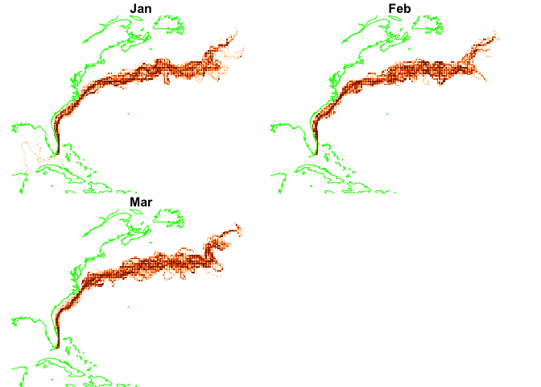
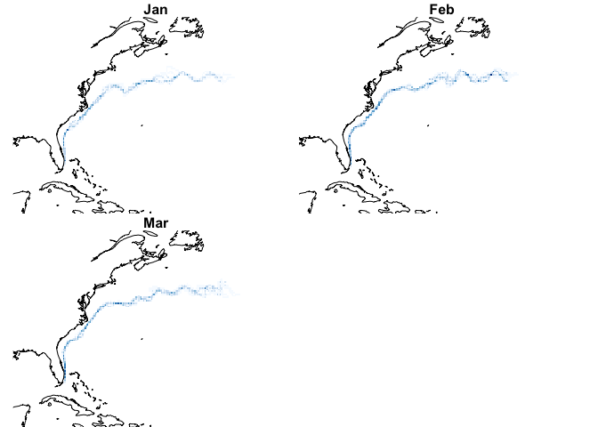
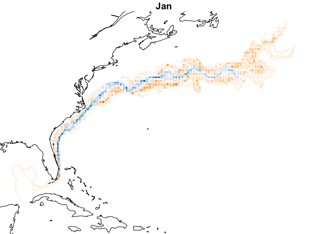
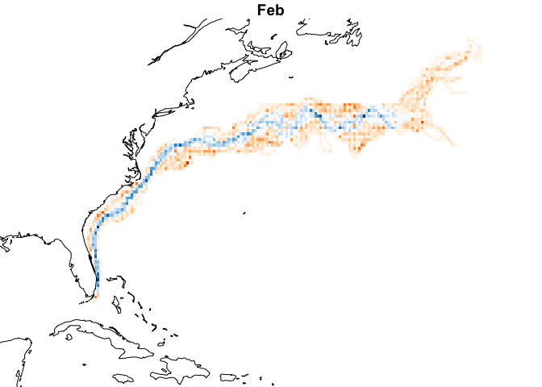
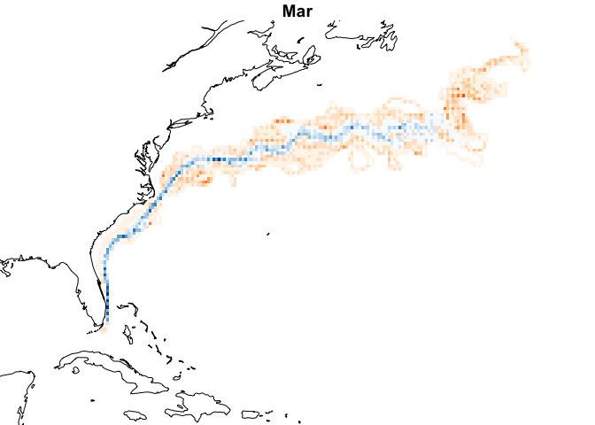

Climatology
================

First let’s show the monthly climatologies.

``` r
month_lut = 1:12 |>
  rlang::set_names(month.abb)
ff = list_files(pattern = "*mc_mean.tif")
names(ff) = substring(basename(ff) , 11, 13)
ff = ff[month.abb]
x = stars::read_stars(ff, along = list(time = month.abb))
nbreaks = 9
plot(dplyr::slice(x, along = "time", index = 1:3), 
     hook = add_coast,
     breaks = "equal",
     nbreaks = nbreaks,
     key.pos = NULL,
     col = brewer.pal(nbreaks - 1, "Oranges"))
```

<!-- -->

And 2024…

``` r
ff = list_files(pattern = glob2rx("2024*mon_count.tif"))
dates = substring(basename(ff), 1, nchar("2010-01-01")) |>
  as.Date()
months = format(dates, "%b")
y = stars::read_stars(ff, along = list(time = months))
plot(dplyr::slice(y, along = "time", index = 1:3), 
     hook = add_coast,
     breaks = "equal",
     nbreaks = nbreaks,
     key.pos = NULL,
     col = brewer.pal(nbreaks - 1 , "Blues"))
```

<!-- -->

And one on top of the other (I hope!)

``` r
double_plot(x,y, "Jan")
```

<!-- -->

``` r
double_plot(x,y, "Feb")
```

<!-- -->

``` r
double_plot(x,y, "Mar")
```

<!-- -->
