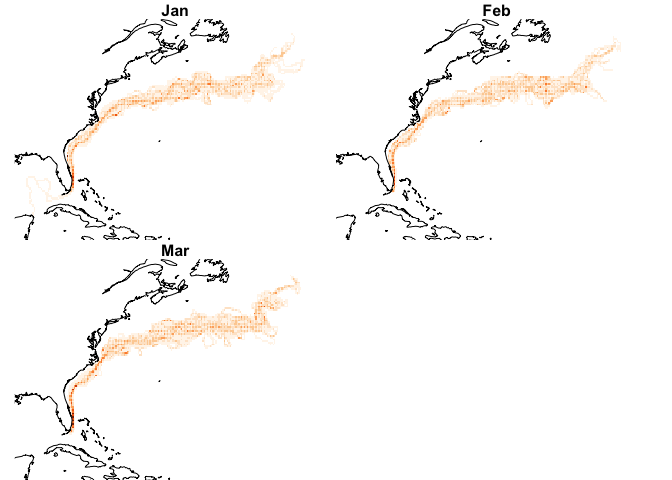

Climatology
================

First let’s show the monthly climatologies.

``` r
month_lut = 1:12 |>
  rlang::set_names(month.abb)
ff = list_files(pattern = "*mc_mean.tif")
names(ff) = substring(basename(ff) , 11, 13)
ff = ff[month.abb]
x = stars::read_stars(ff, along = list(time = month.abb))
plot(dplyr::slice(x, along = "time", index = 1:3), 
     hook = add_coast,
     nbreaks =10,
     key.pos = NULL,
     col = brewer.pal(9, "Oranges"))
```

<!-- -->
